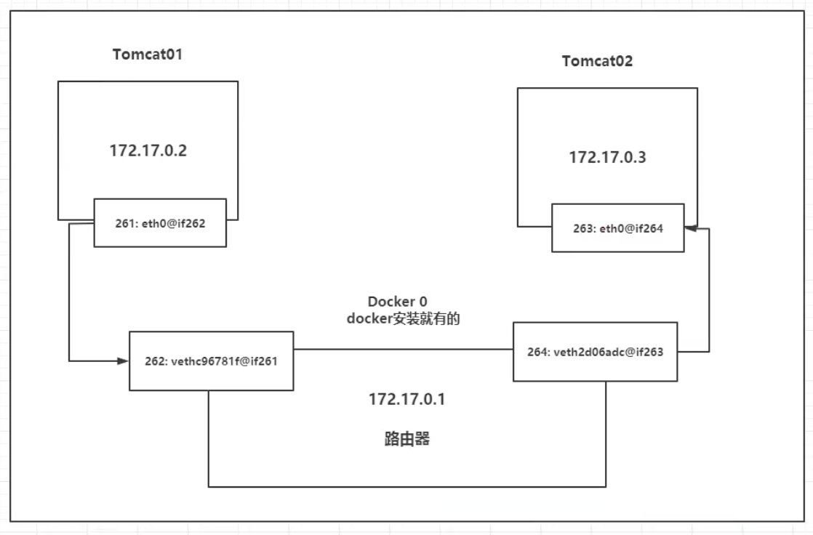

Docker 是一个开源的应用容器引擎，基于 Go 语言 并遵从 Apache2.0 协议开源。

Docker 可以让开发者打包他们的应用以及依赖包到一个轻量级、可移植的容器中，然后发布到任何流行的 Linux 机器上，也可以实现虚拟化。

容器是完全使用沙箱机制，相互之间不会有任何接口（类似 iPhone 的 app）,更重要的是容器性能开销极低。
<!-- more -->

## Docker 安装

> **环境准备**

1. CentOS 7
2. Mac 使用 SSH Shell，Windows 使用 XShell 连接远程服务器

>**环境查看**

```shell
# 系统内核在 3.10 以上
[root@iZm5e7sydivirj1yfamuq8Z ~]# uname -r                                                                                
3.10.0-957.21.3.el7.x86_64 
```

```shell
# 系统版本
[root@iZm5e7sydivirj1yfamuq8Z ~]# cat /etc/os-release   
NAME="CentOS Linux"                             
VERSION="7 (Core)"                              
ID="centos"                                      
ID_LIKE="rhel fedora"                              
VERSION_ID="7"                                 
PRETTY_NAME="CentOS Linux 7 (Core)"              
ANSI_COLOR="0;31"                               
CPE_NAME="cpe:/o:centos:centos:7"                 
HOME_URL="https://www.centos.org/"             
BUG_REPORT_URL="https://bugs.centos.org/"               
CENTOS_MANTISBT_PROJECT="CentOS-7"                                         
CENTOS_MANTISBT_PROJECT_VERSION="7"                                       
REDHAT_SUPPORT_PRODUCT="centos"                                           
REDHAT_SUPPORT_PRODUCT_VERSION="7" 
```

> **Docker 容器引擎的安装部署**

### 1. CentOS 安装 Docker

1. yum 包更新到最新
   `yum update`

2. 卸载旧版本
   旧版本 `Docker` 称为 `docker` 或者  `docker-engine`

   ```shell
   $sudo yum remove docker \
                    docker-client \
                    docker-client-latest \
                    docker-common \
                    docker-latest \
                    docker-latest-logrotate \
                    docker-logrotate \
                    docker-selinux \
                    docker-engine-selinux \
                    docker-engine
   ```

3. 设置存储库
   `yum install -y yum-utils device-mapper-persistent-data lvm2`

4. 设置yum源为阿里云
   `yum-config-manager --add-repo http://mirrors.aliyun.com/docker-ce/linux/centos/docker-ce.repo`

5. 安装 Docker
   `yum install docker-ce -y`
   查看下载的文件
   `yum list installed | grep docker`

6. 启动 Docker
   `systemctl start docker`
   验证有没有启动成功
   `docker images`

7. 配置阿里云配置镜像加速器
   容器镜像服务 - 镜像加速器

   ```shell
   sudo mkdir -p /etc/docker
   sudo tee /etc/docker/daemon.json <<-'EOF'
   {
     "registry-mirrors": ["https://0zi6sztb.mirror.aliyuncs.com"]
   }
   EOF
   sudo systemctl daemon-reload
   sudo systemctl restart docker
   ```

   

### 2. Docker UI: Portainer

1. 选择镜像 下载

   `docker pull docker.io/portainer/portainer`

2. 查看容器
   `docker ps -a`

3. 启动UI

   

   ```shell
   docker run -d 
              -p 9000:9000 
              --restart=always 
              -v /var/run/docker.sock:/var/run/docker.sock 
              --name prtainer-arry 
              portainer/portainer
   ```
   
4. 打开 Docker 可视化页面
   `http://服务器ip:9000`

### 3. Tomcat 项目发布

安装包可在 https://hub.docker.com/ 查看

1. 下载 tomcat

   `docker pull tomcat:8.5.54-jdk8-openjdk`

2. 创建一个守护式容器：如果对于一个需要长期运行的容器来说，我们可以创建一个守护式容器（容器名称不能重复）
   `docker run -d --name=tomcat-8080 -p 8080:8080 -v /usr/local/webapps/:/usr/local/tomcat/webapps/ tomcat:8.5.54-jdk8-openjdk`

### 4. Node.js 项目发布

1. 在Dockerfile文件所在目录下运行以下命令构建一个Image
   `docker build -t [镜像名称] .`
2. 运行镜像
   `docker run -d -p 8888:8888 [镜像名称]`

https://www.cnblogs.com/li-peng/p/5827104.html

### 5. 底层原理

> **Docker 是怎么工作的**

Docker 是一个 Client - Server 结构的系统，Docker 的守护进程运行在主机上，通过 Socket 从客户端访问。

DockerServer 接收到 Docker-Client 的指令，就会执行这个命令。


## Docker 常用指令

### 1. 帮助命令

```shell
docker version			# 显示 docker 的版本信息
docker info					# 显示 docker 的系统信息
docker 命令 --help	# 帮助命令
```

帮助文档地址：https://docs.docker.com/reference/

### 2. 镜像命令

**docker images 查看所有本地主机上的镜像**

```shell
[root@iZm5e7sydivirj1yfamuq8Z ~]# docker images                                
REPOSITORY            TAG       IMAGE ID       CREATED        SIZE            
node-14.15.3-api      latest    18caeda5bf31   2 days ago     958MB             
node                  14.15.3   72aaced1868f   5 weeks ago    942MB           
portainer/portainer   latest    62771b0b9b09   6 months ago   79.1MB  

# repository 镜像的仓库源
# 可选项
--all , -a			# 列出所有镜像
--quiet , -q		# 只显示镜像ID
```

**docker search 搜索镜像**

```shell
[root@iZm5e7sydivirj1yfamuq8Z ~]# docker search mongodb                                                                                                  
NAME                                DESCRIPTION                                     STARS     OFFICIAL   AUTOMATED                                       
mongo                               MongoDB document databases provide high avai…   7489      [OK]                                                       
mongo-express                       Web-based MongoDB admin interface, written w…   859       [OK]         

# 可选项 通过收藏数来过滤
--filter=STARS=3000 # 搜索 STARS 大于3000的镜像

[root@iZm5e7sydivirj1yfamuq8Z ~]# docker search mongodb --filter=STARS=3000                                                                              
NAME      DESCRIPTION                                     STARS     OFFICIAL   AUTOMATED                                                                 
mongo     MongoDB document databases provide high avai…   7489      [OK]                 
```

**docker pull 下载镜像**

```shell
# 下载镜像 docker pull 镜像名[:tag]
[root@iZm5e7sydivirj1yfamuq8Z ~]# docker pull mongo-express
Using default tag: latest   # 如果不写 tag，默认下载最新的 latest
latest: Pulling from library/mongo-express
0a6724ff3fcd: Pull complete    # 分层下载，docker image 的核心  联合文件系统
5fd2bdfdbf4b: Pull complete
80b224d472a8: Pull complete
e21405c347ae: Pull complete
14277cdfbd7c: Pull complete
7ff6a1594a5c: Pull complete
e7203c023e57: Pull complete
8f751d814fa1: Pull complete
Digest: sha256:6ae44c697cd2381772f8ea8f0571008b62e36301305b113df7f35f2e683e8255    # 签名                                                    
Status: Downloaded newer image for mongo-express:latest
docker.io/library/mongo-express:latest   # 真实地址

# 等价的
docker pull mongo-express
docker pull docker.io/library/mongo-express:latest
```

**docker rmi 删除镜像**

```shell
# 删除指定id的镜像
[root@iZm5e7sydivirj1yfamuq8Z ~]# docker rmi -f 容器ID
# 删除多个容器
[root@iZm5e7sydivirj1yfamuq8Z ~]# docker rmi -f 容器ID 容器ID 容器ID
# 删除全部的容器
[root@iZm5e7sydivirj1yfamuq8Z ~]# docker rmi -f $(docker images -aq)
```

### 3. 容器命令

**新建容器并启动**

```shell
docker run [可选参数] [镜像名]

# 参数说明
--name=Name			# 容器名字，用来区分容器
-d							# 后台方式运行
-it							# 使用交互方式运行，进入容器内部
-p							# 指定容器的端口 -p 8080:8080
	-p ip:主机端口:容器端口
	-p 主机端口:容器端口 （常用）
	-p 容器端口
	容器端口
-P							# 随机指定端口

# 测试，启动并进入容器
[root@iZm5e7sydivirj1yfamuq8Z ~]# docker run -it centos
[root@a98c171a363f /]#
```

**列出所有的运行的容器**

```shell
# docker ps 命令
			# 列出当前正在运行的容器
-a 		# 列出当前正在运行的容器 + 历史运行过的容器
-n=?	# 显示最近创建的容器
-q		# 只显示容器的编号

[root@iZm5e7sydivirj1yfamuq8Z ~]# docker ps -aq
68135a1d62ae
a98c171a363f
304e49e0ed96
4935571ec2c6
8bf9e5273298
```

**退出容器**

```shell
exit		# 直接退出容器
Ctrl + P + Q	# 容器不停止退出
```

**删除容器**

```shell
docker rm 容器id	# 删除容器，不能删除正在运行的容器，强制删除 rm -f
docker rm -f $(docker ps -aq)	# 删除所有的容器
```

**启动和停止容器的操作**

```shell
docker start 容器id		# 启动容器
docker restart 容器id # 重启容器
docker stop 容器id		# 停止当前正在运行的容器
docker kill 容器id		# 强制停止当前容器
```

### 4. 常用的其他命令

**后台启动容器**

```shell
# docker run -d 镜像名
[root@iZm5e7sydivirj1yfamuq8Z ~]# docker run -d centos                                                                                                                         
3c59f35473e920a93f87edc3ac1b803a26572ebdbeac6ecf67b47c643d64cb5f                                          

 # 问题：docker ps，发现 centos 停止了
 # 常见的坑：docker 容器使用后台运行，就必须要有一个前台进程，docker 发现没有应用，就会自动停止
```

**查看日志**

```shell
[root@iZm5e7sydivirj1yfamuq8Z ~]# docker logs -f -t --tail 10 容器id

# 如果没有日志，编写一段shell脚本
# docker run -d centos /bin/sh -c "while true;do echo guoxiaobo;sleep 2;done"

# 显示日志
-t -f		# -t：显示日志 -f：加上时间戳（可以写成 -tf）
--tail number	# 显示指定条数的日志
```

**查看容器中进程信息**

```shell
# docker top 容器id
[root@iZm5e7sydivirj1yfamuq8Z ~]# docker top 17135743dc7c                                                                                                                      
UID                 PID                 PPID                C                   STIME               TTY                 TIME                CMD
root                29534               29515               0                   22:10               ?                   00:00:00            /bin/sh -c while true;do echo guoxiaobo;sleep 2;done
root                29820               29534               0                   22:16               ?                   00:00:00            /usr/bin/coreutils --coreutils-prog-shebang=sleep /usr/bin/sleep 2
```

**查看镜像的元数据**

```shell
# docker inspect 17135743dc7c
```

**进入当前正在运行的容器**

```shell
# 我们通常容器都是后台方式运行的，需要进入容器，修改一些配置

# 方式一：进入容器
[root@iZm5e7sydivirj1yfamuq8Z ~]# docker exec -it 17135743dc7c /bin/bash
[root@17135743dc7c /]# ps -ef		# 用标准的格式显示进程                                                           
UID        PID  PPID  C STIME TTY          TIME CMD                                                                                                                            
root         1     0  0 14:10 ?        00:00:00 /bin/sh -c while true;do echo guoxiaobo;sleep 2;done                                                                           
root      1854     0  0 15:11 pts/0    00:00:00 /bin/bash                                                                                                                      
root      1908     1  0 15:13 ?        00:00:00 /usr/bin/coreutils --coreutils-prog-shebang=sleep /usr/bin/sleep 2                                                             
root      1909  1854  0 15:13 pts/0    00:00:00 ps -ef    

# 方式二
[root@iZm5e7sydivirj1yfamuq8Z ~]# docker attach 17135743dc7c                                                                                                                   
guoxiaobo                                                                                                                                                                      
guoxiaobo

# docker exec			# 进入容器后开启一个新的终端，可以在里面操作（常用）
# docker attach		# 进入容器正在执行的终端，不会启动新的进程
```

**从容器内拷贝文件到主机上**

```shell
docker cp 容器id:容器内文件路径 目的主机路径

# 拷贝是一个手动的过程，后面通过 -v 卷技术，可以实现自动同步
```

### 练习

**Docker 安装 Nginx**

```shell
# docker pull nginx 下载镜像

# 运行镜像
[root@iZm5e7sydivirj1yfamuq8Z ~]# docker run -d --name=nginx01 -p 3344:80 nginx  
1747791356e881a4ccc3d95d0e404faf0fac0ff2bc0fa1d521769cf6ceb59dcf 
# 本地测试
[root@iZm5e7sydivirj1yfamuq8Z ~]# curl localhost:3344                 
<!DOCTYPE html>                                 
<html>                                                                                                                    
<head>                                                                                                                    
<title>Welcome to nginx!</title>                                                                                          
<style>
    body {
        width: 35em;
        margin: 0 auto;
        font-family: Tahoma, Verdana, Arial, sans-serif;
    }
</style>
...
```

**Docker 安装 Tomcat**

```shell
# 官方的使用
docker run -it -rm tomcat:9.0		# 用完即删除镜像

# 正常使用
[root@iZm5e7sydivirj1yfamuq8Z ~]# docker run -d -p 3004:8080 --name=tomcat01 tomcat 
```


## Docker 镜像操作

**commit 镜像**

```shell
docker commit # 提交容器成为一个新的镜像

# 命令和git原理类似
docker commit -m="描述信息" -a="作者" [容器id] [目标镜像名:tag]
```


## 容器数据卷

容器之间有一个数据共享的技术！Docker 容器中产生的数据，同步到本地！这种技术就是卷技术！

实现目录的挂载，将我们容器的目录挂载到 Linux 上。

> **方式一：使用命令的方式来挂载 -v**

```shell
docker run -it -v 主机目录:容器目录 镜像名 /bin/bash

# 启动之后，可以通过 docker inspect 容器id 查看
```


### 安装 MySql

```shell
# 获取镜像
# docker pull mysql:5.7

# 运行容器，需要配置密码
-d 后台运行
-p 端口映射
-v 卷挂载
-e 环境配置
--name 命名
# docker run -d -p 3310:3306 -v /home/mysql/conf:/etc/mysql/conf.d -v /home/mysql/data:/var/lib/mysql -e MYSQL_ROOT_PASSWORD=123456 --name mysql_bind mysql:5.7         

# 假设将容器删除，我们挂载到本地的数据库文件依旧存在，这就实现了容器数据持久化！
```

### 具名和匿名挂载

```shell
# 匿名挂载
-v 容器内路径
docker run -d -P --name nginx01 -v /etc/nginx nginx

# 查看所有的卷情况
# docker volume ls

[root@iZm5e7sydivirj1yfamuq8Z home]# docker volume ls                                                                                                                                                     
DRIVER    VOLUME NAME                                                                                                                                                                                     
local     36fcaf3e61ecd79c39148fe669ce5c8355a4e55a4caf9476f8e224f3920e4791      # 匿名
```

```shell
# 具名挂载
-v 名字:容器内路径
# docker run -d -P --name nginx02 -v juming-nginx:/etc/nginx nginx
[root@iZm5e7sydivirj1yfamuq8Z home]# docker volume ls        
DRIVER    VOLUME NAME                                                                                                                                
local     juming-nginx  # 具名
# 查看卷的具体信息
[root@iZm5e7sydivirj1yfamuq8Z home]# docker volume inspect juming-nginx                            
[                                                                                                                                                                                                         
    {                                                                                                                                                                                                     
        "CreatedAt": "2021-01-30T08:51:11+08:00",       
        "Driver": "local",        
        "Labels": null,                                                                                             
        "Mountpoint": "/var/lib/docker/volumes/juming-nginx/_data",  
        "Name": "juming-nginx",  
        "Options": null,        
        "Scope": "local"      
    }                                                                                                                                                                                                     
]  
```

所有的 docker 容器内的卷，没有指定目录的情况下都是在`/var/lib/docker/volumes/xxxx/_data`

大多数情况，我们使用 `具名挂载`

拓展：

```shell
ro # 只读，说明这个路径只能通过宿主机来操作，容器内部是无法操作的
rw # 只写

# 一旦设置了容器权限，容器对我们挂载出来的内容就有限定了
# docker run -d -P --name nginx02 -v juming-nginx:/etc/nginx:ro nginx
```

### 初识 Dockerfile

> **方式二：编写 dockerfile 文件挂载**

```shell
# 创建一个 dockerfile 文件，文件内的一条指令对应镜像的一层
[root@iZm5e7sydivirj1yfamuq8Z docker-file-test]# vim dockerfile1                                                                                                                                          
[root@iZm5e7sydivirj1yfamuq8Z docker-file-test]# cat dockerfile1                                                                                                                                          
FROM centos    # 镜像基于 centos                                                                                                                                                                                           
                                                                                                                                                                                                          
VOLUME ["volume01", "volume02"]       # 挂载                                                                                                                                                                    
                                                                                                                                                                                                          
CMD echo "-------end------"                                                                                                                                                                               
CMD /bin/bash                                                                                                                                                                                             

# 构建镜像
[root@iZm5e7sydivirj1yfamuq8Z docker-file-test]# docker build -f dockerfile1 -t guoxb/centos .

# 查看镜像列表
[root@iZm5e7sydivirj1yfamuq8Z docker-file-test]# docker images                                                                                                                                            
REPOSITORY            TAG       IMAGE ID       CREATED          SIZE                                                                                                                                      
guoxb/centos          latest    93370156ea8b   32 seconds ago   209MB

# 运行我们的容器
[root@iZm5e7sydivirj1yfamuq8Z docker-file-test]# docker run -it 5c5d2169b8a0                     
[root@3a8456c4fa25 /]# ls                                                                                                                                                                                 
bin  dev  etc  home  lib  lib64  lost+found  media  mnt  opt  proc  root  run  sbin  srv  sys  tmp  usr  var  volume01  volume02
# volume01  volume02 这个目录就是我们生成镜像的时候自动挂载的（匿名挂载），数据卷目录
# 这个卷和外部一定有一个同步的目录
# docker inspect 82a5f09a71f7 查看容器信息
```


假设构架镜像的时候没有挂载卷，要手动为镜像挂载：`-v 卷名:容器内路径`

### 数据卷容器

> **方式三：--volumes-from 挂载**

多个 mysql 同步数据


docker01 即为数据卷容器


## Dockerfile

dockerfile 用来构建 docker 镜像的文件！

构建步骤：

1. 编写一个 dockerfile 文件
2. docker build 构建成为一个镜像
3. docker run 运行镜像
4. docker push 发布镜像（DockerHub、阿里云镜像仓库）

### 指令

```shell
FROM					# 基础镜像，一切从这里开始构建
MAINTAINER		# 镜像是谁写的，姓名+邮箱
RUN						# 镜像构建的时候需要运行的命令
ADD						# 步骤：tomcat 镜像，这个 tomcat 压缩包！添加内容
WORKDIR				# 镜像的工作目录
VOLUME				# 挂载的目录
EXPOSE				# 暴露端口-保留端口配置
CMD						# 指定这个容器启动的时候要运行的命令：只有最后一个会生效，可被替代
ENTRYPOINT		# 指定这个容器启动的时候要运行的命令：可以追加命令
ONBUILD				# 当构建一个被继承 Dockerfile 的时候就会运行 ONBUILD 指令。触发指令
COPY					# 类似 ADD，将我们文件拷贝到镜像中
ENV						# 构建的时候设置环境变量
```

> **CMD 和 ENTRYPOINT 区别**

```shell
CMD ["ls", "-a"]
# docker run -l  =>  Error（-l 替换了 ls -a，所以报错）

ENTRYPOINT ["ls", "-a"]
# docker run -l  =>  ls -al（-l 追加在 ls -a 后面）
```


### 实战

Docker Hub 中 99% 镜像都是从这个基础镜像过来的 `FROM scratch`，然后配置需要的软件和配置来进行的构建

> **创建一个自己的 centos**

```shell
# 1. 编写 Dockerfile 文件
[root@iZm5e7sydivirj1yfamuq8Z dockerfiles]# cat dockerfile_my_centos
FROM centos                                                                     
MAINTAINER guoxb<gxbxemail@163.com>                                             
                                                                                
ENV MYPATH /usr/local                                                           
WORKDIR $MYPATH                # 希望进入容器直接在该目录下                     
                                                                                
RUN yum -y install vim         # 添加 vim 指令                                  
RUN yum -y install net-tools   # 添加 ifconfig 指令                             
                                                                                
EXPOSE 80                                                                       
                                                                                
CMD echo $MYPATH      
CMD echo "----end----"
CMD /bin/bash

# 2. 通过这个文件构建镜像
[root@guoxb dockerfiles]# docker build -f dockerfile_my_centos -t mycentos:0.1 .

# 3. 测试运行
[root@iZm5e7sydivirj1yfamuq8Z dockerfiles]# docker run -it mycentos:0.1
[root@56faa376f9c3 local]# ls
bin  etc  games  include  lib  lib64  libexec  sbin  share  src
[root@56faa376f9c3 local]# pwd
/usr/local
```

我们可以列出本地镜像的变更历史

```shell
[root@iZm5e7sydivirj1yfamuq8Z dockerfiles]# docker history ff91b0d1fc9f                                                                                                      
IMAGE          CREATED         CREATED BY                                      SIZE      COMMENT                                                                             
ff91b0d1fc9f   7 minutes ago   /bin/sh -c #(nop)  CMD ["/bin/sh" "-c" "/bin…   0B        
43a790ec69f1   7 minutes ago   /bin/sh -c #(nop)  CMD ["/bin/sh" "-c" "echo…   0B        
6a308d482c0a   7 minutes ago   /bin/sh -c #(nop)  CMD ["/bin/sh" "-c" "echo…   0B        
16eba5136010   7 minutes ago   /bin/sh -c #(nop)  EXPOSE 80                    0B        
b404f46f94b6   7 minutes ago   /bin/sh -c yum -y install net-tools             23.3MB    
e9cdf9c370e0   8 minutes ago   /bin/sh -c yum -y install vim                   58.1MB    
ebd6879e0f3d   8 minutes ago   /bin/sh -c #(nop) WORKDIR /usr/local            0B        
38e92dbca281   8 minutes ago   /bin/sh -c #(nop)  ENV MYPATH=/usr/local        0B        
d7a86a6e55d6   8 minutes ago   /bin/sh -c #(nop)  MAINTAINER guoxb<gxbxemai…   0B        
300e315adb2f   7 weeks ago     /bin/sh -c #(nop)  CMD ["/bin/bash"]            0B        
<missing>      7 weeks ago     /bin/sh -c #(nop)  LABEL org.label-schema.sc…   0B        
<missing>      7 weeks ago     /bin/sh -c #(nop) ADD file:bd7a2aed6ede423b7…   209MB 
```

### 发布自己的镜像

> **DockerHub**

1. 地址 https://hub.docker.com/ 注册自己的账号

2. 在我们服务器上提交自己的镜像

   ```shell
   [root@iZm5e7sydivirj1yfamuq8Z /]# docker login --help                                                                                                                          
                                                                                                                             
   Usage:  docker login [OPTIONS] [SERVER]                                                                                   
                                                                                                                             
   Log in to a Docker registry.                                                                                              
   If no server is specified, the default is defined by the daemon.                                                          
                                                                                                                             
   Options:                                                                                                                  
     -p, --password string   Password                                                                                        
         --password-stdin    Take the password from stdin                                                                    
     -u, --username string   Username
   ```

3. 登录完毕后就可以提交镜像了

   ```shell
   [root@iZm5e7sydivirj1yfamuq8Z /]# docker images                                                                                                                                
   REPOSITORY            TAG       IMAGE ID       CREATED        SIZE                                                                                                             
   mycentos              0.1       ff91b0d1fc9f   24 hours ago   291MB
   
   # push 镜像的问题？
   [root@iZm5e7sydivirj1yfamuq8Z /]# docker push guoxiaobo/mycentos:0.1                                                                                                           
   The push refers to repository [docker.io/guoxiaobo/mycentos]                                                                                                                   
   An image does not exist locally with the tag: guoxiaobo/mycentos # 失败
   
   # 解决，增加一个 tag
   [root@iZm5e7sydivirj1yfamuq8Z /]# docker tag mycentos:1.0 guoxiaobo/mycentos:1.0 
   [root@iZm5e7sydivirj1yfamuq8Z /]# docker push guoxiaobo/mycentos:1.0                                                                                                           
   The push refers to repository [docker.io/guoxiaobo/mycentos]
   20ae4dd0cb18: Pushing [======================>                            ]  10.37MB/23.33MB                                                                                   
   b6a9fd2ac02d: Pushing [========================>                          ]  28.11MB/58.05MB                                                                                   
   2653d992f4ef: Pushing [======>                                            ]  28.36MB/209.3MB
   ```

> **阿里云镜像**

1. 进入控制台-容器镜像服务

2. 创建命名空间

3. 创建镜像仓库

4. 浏览阿里云，提交镜像

   

> **小结**


## Docker 网络


三个网络

`# 问题：docker 是如何处理容器网络访问的？`

```shell
[root@iZm5e7sydivirj1yfamuq8Z dockerfiles]# docker run -d -P --name tomcat01 tomcat 

# 查看容器的内部网络地址 ip addr，发现容器启动的时候会得到一个 eth0@if127 IP地址，这是 docker 分配的！
[root@iZm5e7sydivirj1yfamuq8Z dockerfiles]# docker exec -it tomcat01 ip addr                                                                                                   
1: lo: <LOOPBACK,UP,LOWER_UP> mtu 65536 qdisc noqueue state UNKNOWN group default qlen 1000                                                                                    
    link/loopback 00:00:00:00:00:00 brd 00:00:00:00:00:00                                                                                                                      
    inet 127.0.0.1/8 scope host lo                                                                                                                                             
       valid_lft forever preferred_lft forever                                                                                                                                 
126: eth0@if127: <BROADCAST,MULTICAST,UP,LOWER_UP> mtu 1500 qdisc noqueue state UP group default                                                                               
    link/ether 02:42:ac:11:00:04 brd ff:ff:ff:ff:ff:ff link-netnsid 0                                                                                                          
    inet 172.17.0.4/16 brd 172.17.255.255 scope global eth0                                                                                                                    
       valid_lft forever preferred_lft forever
       
# 思考：Linux 能不能 ping 通容器内部？
[root@iZm5e7sydivirj1yfamuq8Z dockerfiles]# ping 172.17.0.4                                                                                                                    
PING 172.17.0.4 (172.17.0.4) 56(84) bytes of data.                                                                                                                             
64 bytes from 172.17.0.4: icmp_seq=1 ttl=64 time=0.106 ms                                                                                                                      
64 bytes from 172.17.0.4: icmp_seq=2 ttl=64 time=0.070 ms

# Linux 可以 ping 通 docker 容器内部
```

> **原理**

1. 我们每启动一个 docker 容器，docker 就会给 docker 容器分配一个 ip，我们只要安装了 docker，就会有一个网卡 docker0 桥接模式，使用的技术是 veth-pair 技术！


```shell
# 我们发现这个容器带来的网卡，都是一对一对的
# veth-pair 就是一对的虚拟设备接口，他们都是成对出现的，一段连着协议，一段彼此相连
# 正因为有这个特性，veth-pair 充当一个桥梁
```

2. 测试下 tomcat01 和 tomcat02 是否可以 ping 通？

```shell
[root@iZm5e7sydivirj1yfamuq8Z dockerfiles]# docker exec -it tomcat02 ip addr
[root@iZm5e7sydivirj1yfamuq8Z dockerfiles]# docker exec -it tomcat01 ip addr 
[root@iZm5e7sydivirj1yfamuq8Z dockerfiles]# docker exec -it tomcat01 ping 172.17.0.5
```



结论：tomcat01 和 tomcat02 是公用的一个路由器 - docker0。

所有的容器不指定网络的情况下，都是 docker0 路由的，docker 会给我们的容器分配一个默认可用的 ip

### --link

> **思考：我们编写一个微服务，database url=ip：，项目重启，数据库ip变了，连不上了；我们希望可以处理这个问题，可以通过名字访问容器**

例如：`docker exec -it tomcat01 ping tomcat02` 是不通的

解决：我们可以使用 `--link` 解决这个问题

```shell
# docker run -it --name tomcat01 --link tomcat02 tomcat
```

此时 tomcat01 是可以 ping 通 tomcat02 的，反过来能不能 ping 通呢？不能！

```shell
# 查看容器 hosts 配置
[root@iZm5e7sydivirj1yfamuq8Z ~]# docker ps
CONTAINER ID   NAMES
247b6904b38f   tomcat02
e455cff7c7b8   tomcat01

[root@iZm5e7sydivirj1yfamuq8Z ~]# docker exec -it tomcat01 cat /etc/hosts
127.0.0.1       localhost
172.17.0.2      e455cff7c7b8

[root@iZm5e7sydivirj1yfamuq8Z ~]# docker exec -it tomcat02 cat /etc/hosts
127.0.0.1       localhost
172.17.0.2      tomcat01 e455cff7c7b8 
172.17.0.3      247b6904b38f

# --link 就是在 hosts 配置中增加了一个 tomcat01 的映射 172.17.0.2    tomcat01 e455cff7c7b8
# 也就是我们 ping 镜像名称 或 镜像ID，会直接映射到 172.17.0.2，所以可以 ping 通
```

### 自定义网络

> 查看所有docker网络

```shell
[root@iZm5e7sydivirj1yfamuq8Z ~]# docker network ls
NETWORK ID     NAME      DRIVER    SCOPE           
2a10ae850766   bridge    bridge    local           
64092a54de34   host      host      local           
736a8a5d6989   none      null      local           
```

知识点：网络模式

1. bridge：桥接（docker，创建网络也用bridge模式）
2. none：不配置网络
3. host：和宿主机共享网络
4. container：容器网络联通（用的少，局限大）

测试：

```shell
# --net bridge 是一个默认参数，而这个就是 docker0
docker run -d -P --name tomcat01 tomcat
docker run -d -P --name tomcat01 --net bridge tomcat

# docker0 特点：（1）默认的；（2）域名不能访问；（3）--link 可以打通连接（比较麻烦）

# 基于以上不足，我们自定义一个网络！
# --driver bridge							桥接
# --subnet 192.168.0.0/16			子网
# --gateway 192.168.0.1				网关
[root@iZm5e7sydivirj1yfamuq8Z ~]# docker network create --driver bridge --subnet 192.168.0.0/16 --gateway 192.168.0.1 mynet

[root@iZm5e7sydivirj1yfamuq8Z ~]# docker network ls
NETWORK ID     NAME      DRIVER    SCOPE
2a10ae850766   bridge    bridge    local
64092a54de34   host      host      local
1b599f8ce9b9   mynet     bridge    local
736a8a5d6989   none      null      local
```

到这里，我们自己的网络就创建好了！之后的服务我们就可以放在我们自己的网络里面。


启动两个容器在 mynet

```shell
[root@iZm5e7sydivirj1yfamuq8Z ~]# docker run -d -P --name tomcat-net-01 --net mynet tomcat
[root@iZm5e7sydivirj1yfamuq8Z ~]# docker run -d -P --name tomcat-net-02 --net mynet tomcat

# 查看 mynet 详请
[root@iZm5e7sydivirj1yfamuq8Z ~]# docker network inspect mynet
[                                                                                                 
    {                                                                                             
        "Name": "mynet",
        "Id": "1b599f8ce9b99e16d53a428849466f770bdbd0a451acefa706c8c02e2918f736",                 
        "Created": "2021-02-01T13:45:13.742621517+08:00",                                         
        "Scope": "local",                                                                         
        "Driver": "bridge",                                                                       
        "EnableIPv6": false,
        "IPAM": {                                                                                 
            "Driver": "default",
            "Options": {},
            "Config": [                                                                           
                {                                                                                 
                    "Subnet": "192.168.0.0/16",                                                   
                    "Gateway": "192.168.0.1"
                }                                                                                 
            ]                                                                                     
        },     
        "Internal": false, 
        "Attachable": false, 
        "Ingress": false,                                                                         
        "ConfigFrom": {                                                                           
            "Network": ""                                                                         
        },  
        "ConfigOnly": false,   
        "Containers": {                                                                           
            "720e5432f1d2d39c67a95f2d9cc07c5ab72e2b37834ccf6d3d268c787ce32adb": {                 
                "Name": "tomcat-net-01",      
                "EndpointID": "24beee65adafe0775b73453a13c52a36be6c6d99fc117c219c7a0eaa1052a079", 
                "MacAddress": "02:42:c0:a8:00:02",
                "IPv4Address": "192.168.0.2/16",
                "IPv6Address": ""                                                                 
            },               
            "d8ce9e2d80d08cb7094a68caad5d85c1aeaf990f1f1bfb372eff0617396a7fc9": {                 
                "Name": "tomcat-net-02", 
                "EndpointID": "5dfec94bdf30a9ff038c66053eaa030f3f76538a823120aa3ace32c0e6700017", 
                "MacAddress": "02:42:c0:a8:00:03",
                "IPv4Address": "192.168.0.3/16",
                "IPv6Address": ""
            }
        },
        "Options": {},
        "Labels": {}
    }
]

# tomcat-net-01 与 tomcat-net-02 互 ping 是可以 ping 通的！
[root@iZm5e7sydivirj1yfamuq8Z ~]# docker exec -it tomcat-net-01 ping tomcat-net-02
PING tomcat-net-02 (192.168.0.3) 56(84) bytes of data.
64 bytes from tomcat-net-02.mynet (192.168.0.3): icmp_seq=1 ttl=64 time=0.080 ms
64 bytes from tomcat-net-02.mynet (192.168.0.3): icmp_seq=2 ttl=64 time=0.085 ms
64 bytes from tomcat-net-02.mynet (192.168.0.3): icmp_seq=3 ttl=64 time=0.075 ms

[root@iZm5e7sydivirj1yfamuq8Z ~]# docker exec -it tomcat-net-02 ping tomcat-net-01
PING tomcat-net-01 (192.168.0.2) 56(84) bytes of data.
64 bytes from tomcat-net-01.mynet (192.168.0.2): icmp_seq=1 ttl=64 time=0.047 ms
64 bytes from tomcat-net-01.mynet (192.168.0.2): icmp_seq=2 ttl=64 time=0.066 ms
```

使用自建网络的好处：不同集群使用不同的网络，保证集群是安全和健康的！


### 网络连通


## Docker-Compose

> **官方介绍**

[Docker Compose](https://docs.docker.com/compose/) is a tool that was developed to help define and share multi-container applications. With Compose, we can create a YAML file to define the services and with a single command, can spin everything up or tear it all down.

1. 帮助定义、运行多个容器的工具
2. 需要定义一个 YAML file 配置文件
3. 用一些 single command 命令

### 安装

1. 下载

```shell
sudo curl -L "https://github.com/docker/compose/releases/download/1.28.2/docker-compose-$(uname -s)-$(uname -m)" -o /usr/local/bin/docker-compose
```

2. 授权

```shell
sudo chmod +x /usr/local/bin/docker-compose
```

### YAML 规则

https://docs.docker.com/compose/compose-file/compose-file-v3/

```shell
# 3层

version: "3.8"  # 版本
services:		# 服务
	服务1：web
		# 服务配置
		images
		build
		network
		...
	服务2：redis
		...
# 其他配置：网络/卷、全局规则
volumes:
networks:
configs:
```

### docker-compose 命令模板

两个重要的概念：

1. 服务（service）：一个服务就是一个应用容器
2. 项目（project）：由多个服务共同组成的一个具有相同业务逻辑单元

```yaml
version: "3.8" # compose 版本

services:
  tomcat01: # 服务名
    # container_name: tomcat01_name # 相当于 run 的 --name
    image: tomcat # 指定镜像名称 相当于 run image
    ports: # 完成host与容器端口映射关系 相当于 run 的 -p
      - "3000:8080"
    volumes: # 数据卷所挂载路径设置 相当于 run 的 -v
      #- /home/docker-study:/usr/local/tomcat/webapps # 自定义路径映射
      - tomcatwebapps:/usr/local/tomcat/webapps
    networks: # 相当于 run 的 --network
      - docker_study # 代表当前服务使用哪个网络桥
  tomcat02: # 服务名
    # container_name: tomcat02_name # 相当于 run 的 --name
    image: tomcat # 指定镜像名称
    ports: # 完成host与容器端口映射关系
      - "3001:8080"
    volumes: # 数据卷所挂载路径设置
      #- /home/docker-study:/usr/local/tomcat/webapps # 自定义路径映射
      - tomcatwebapps:/usr/local/tomcat/webapps
    networks:
      - docker_study
  mysql:
    environment: # 环境配置 相当于 run 的 -e
      - MYSQL_ROOT_PASSWORK=root
    # env_file: # 用来将 environment 中的环境变量放入 mysql.env 文件中，避免私密信息暴露
    #   - ./mysql.env
  web:
    # build: # 启动服务时，先将 build 命令中指定的 Dockerfile 打包成镜像，再运行该镜像
    #   context: [Dockerfile路径]
    #   dockerfile: [Dockerfile名称]
    # container_name: web
    depends_on: # 代表这个容器必须依赖哪些容器启动之后才能启动
      - tomcat01 # 这里写的是 *服务名*
      - mysql


volumes:
  tomcatwebapps: # 定义使用的卷名
    external: # 使用自定义卷名
      false   # ture 确定使用自定义卷名(前提：需在服务器将此卷名创建出来)

networks: # 定义服务用到的桥 默认创建的是 bridge
  docker_study:
    external: # 使用自定义网络名称
      false   # ture 确定使用自定义网络名(前提：需在服务器将此网络创建出来)
```

### docker-compose 指令

```shell
# docker-compose 命令选项
-f: 指定使用的 Compose 模板文件，默认为 docker-compose.yml
-p: 指定项目名称，默认使用所在目录名称作为项目名

# docker-compose up
默认情况下，如果服务容器已经存在，docker-compose up 将会尝试停止容器，然后重新创建（保持使用 volume-from 挂载的卷），以保证启动的服务匹配 docker-compose.yml 文件的最新内容
-d: 将会在后台启动并运行所有容器

# docker-compose down
将会停止 up 命令所启动的容器，并移除网络

# docker-compose exec mysql(docker-compose.yml中声明的服务id) bash
进入容器

# docker-compose top
查看各个服务容器内运行的进程

# docker-compose logs [服务id]
查看服务日志
```

### 常用指令

```shell
docker-compose up -d nginx                     		构建建启动nignx容器
docker-compose exec nginx bash            				登录到nginx容器中
docker-compose down                             	删除所有nginx容器,镜像
docker-compose ps                                 显示所有容器
docker-compose restart nginx                   		重新启动nginx容器
docker-compose run --no-deps --rm php-fpm php -v  在php-fpm中不启动关联容器，并容器执行php -v 执行完成后删除容器
docker-compose build nginx                     		构建镜像 。        
docker-compose build --no-cache nginx   					不带缓存的构建。
docker-compose logs  nginx                     		查看nginx的日志 
docker-compose logs -f nginx                   		查看nginx的实时日志
docker-compose config  -q                        	验证（docker-compose.yml）文件配置，当配置正确时，不输出任何内容，当文件配置错误，输出错误信息。 
docker-compose events --json nginx       					以json的形式输出nginx的docker日志
docker-compose pause nginx                 				暂停nignx容器
docker-compose unpause nginx             					恢复ningx容器
docker-compose rm nginx                       		删除容器（删除前必须关闭容器）
docker-compose stop nginx                    			停止nignx容器
docker-compose start nginx                    		启动nignx容器
```


## 镜像安装

### nginx

```shell
mkdir -p /home/nginx/www /home/nginx/logs /home/nginx/conf

-v /home/nginx/www:/usr/share/nginx/html -v /home/nginx/conf/nginx.conf:/etc/nginx/nginx.conf -v /home/nginx/logs:/var/log/nginx /home/data/www/gitroot/gxbxblog:/home/data/www/gitroot/gxbxblog nginx
```

