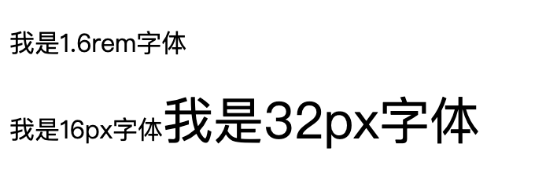
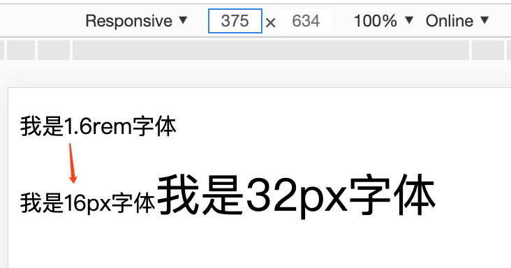
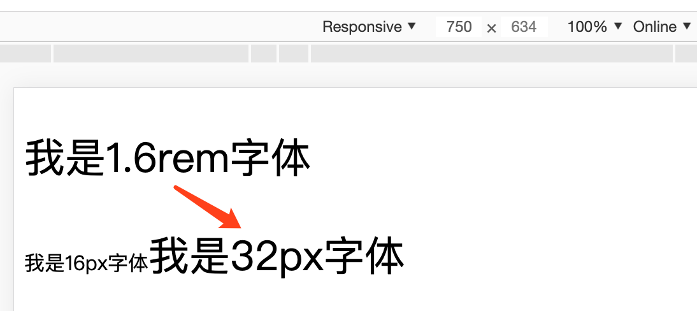

从事前端以来，遇到很多项目开发当中的问题，也积累了很多经验。

以下总结了前端代码编写规范和网页在不同屏幕大小的适配，目的在于让开发者规范自己的代码，不仅看起来清晰，也便于后期代码维护。

我们的目标是：走自己的路，也让别人有路可走~
<!-- more -->

## 1. 命名规范

* 所有命名小写
* 样式命名用“`-`”或“`_`”分割，比如：header-left，header_left
* 属性值用双引号(`""`)包起来
* 标签层次排版规律工整
* html 与 css 分离，html标签中最好不要出现样式
* `<h1>`到`<h5>`的定义，应遵循从大到小的原则，体现文档的结构，并有利于搜索引擎的查询
* 图片加上 `alt` 属性
* 命名尽量不缩写，尽量用英文表示
* 不要随便使用`id`
* 样式命名不可太简单，也不可用标签名称命名，容易引起样式冲突，比如：left，top，p等，随口能蹦出来的名称
* 【很重要】`<a>`标签不可以包在块儿元素外层

**开发中遇到的各种样式问题及解决方案，请访问：[HTML5 笔记](https://www.guoxb.com/2019/01/25/HTML5/HTML5%20%E7%AC%94%E8%AE%B0/)**

## 2. 计量单位

#### （1）计量单位一般有三种：

> * px：固定像素值
> * em：相对父级节点的`font-size`作为当前节点1em所代表的像素值
> * rem：相对根节点`html`的`font-size`作为当前节点1rem所代表的像素值

pc端大屏显示的网页，使用固定像素值；手机端小屏幕展示的网页，可以使用rem（看需求），em基本不用。

#### （2）rem 的简单计算

一般浏览器默认的`html`字体大小是`font-size: 16px`，那么`1rem = 16px`，样式可以这么写：`font-size: 1rem;`。

那么`13px`是多少`rem`？？？算起来有些困难。

如果样式里所有像素值都这么算，这活儿就干不下去了。。。

**解决方案：**

第一种：使用less

```
@r: 10rem;
.title {font-size: 10/@r;}
```

样式查看是这样的

```
.title {
    font-size: 0.8125rem;
}
```

less虽然可以解决这个问题，但是很不直观，不好维护。

第二种：换算一下，让`10px = 1rem`

html页面所有标签样式单位依赖于html的`font-size`，所以让`font-size = 10px`即可

> 但是，为了兼容性和未来发展趋势的综合考虑，px这个单位的含义已经越来越混乱，几乎无法评估以后的设备是会一直像现在这样对网页上的px做兼容处理，还是让px回归“像素”的本意
如果，设置html {font-size: 62.5%;}，1rem = 16px*62.5%=10px，14px=1.4rem；
而且，62.5%代表默认字体尺寸的62.5%，这个含义基本不会有混乱

## 3. 屏幕适配

随着互联网的快速发展，html5+css3也在迅速崛起，响应式布局也随之而出。

响应式布局可以兼容多个终端，做一个网站可能会运行在不同屏幕上，比如：PC，手机，iPad。

如果同时兼容3个终端，面对不同设备灵活性强，能够快速解决多设备显示的问题；但是，也有不能完全兼容所有浏览器，代码累赘，加载时间长以及不能完成所有内容都显示的缺点。

如何做到响应式布局？那就是通过媒体查询`@media`，通过判断终端设备宽度在哪个像素范围，执行不同的CSS样式。

#### 用rem对不同手机端屏幕适配

实现原理其实就是通过监听不同屏幕大小，去改变html的font-size大小

例如：现在一个文字 在375屏幕上大小是16px，在750屏幕上是32px，该怎么实现？直接上代码：

html 代码

```html
<div>
	<p>我是1.6rem字体</p>
	<p>我是16px字体<span>我是32px字体</span></p>
</div>
```

css 代码

```css
<style>
    html{
        font-size: 62.5%;
    }
    .rem_p{
        font-size: 1.6rem;
    }
    .rem_p span{
        font-size: 3.2rem;
    }
    .normal_p{
        font-size: 16px;
    }
    .normal_p span{
        font-size: 32px;
    }
</style>
```

你会看到1.6rem和16px字体大小是一样的



现在屏幕改变是不会对字体大小产生作用的，下面通过js监听屏幕变化，改变html的font-size

```
/**
 * docEl: 获取页面html节点
 * resizeEvt: 事件名称 orientationchange - 旋转屏幕  resize - 大小变化
 * recalc: 改变html的fontSize函数
 */

(function (doc, win) {
	var docEl = doc.documentElement, resizeEvt = 'orientationchange' in window ? 'orientationchange' : 'resize',
		recalc = function () {
			var clientWidth = docEl.clientWidth;
			if (!clientWidth) return;
			if (clientWidth > 750) {
				docEl.style.fontSize = '125%'; // 20px
			}
			else {
				docEl.style.fontSize = clientWidth / 37.5 + 'px';
			}
		}
	recalc();
	if (!doc.addEventListener) return;
	win.addEventListener(resizeEvt, recalc, false);
	doc.addEventListener('DOMContentLoaded', recalc, false);
})(document, window);
```

手机端屏幕大小 375 ~ 750 范围对应 html 的font-size大小在 10px ~ 20px，即 62.5% ~ 125%

引入js，查看页面



