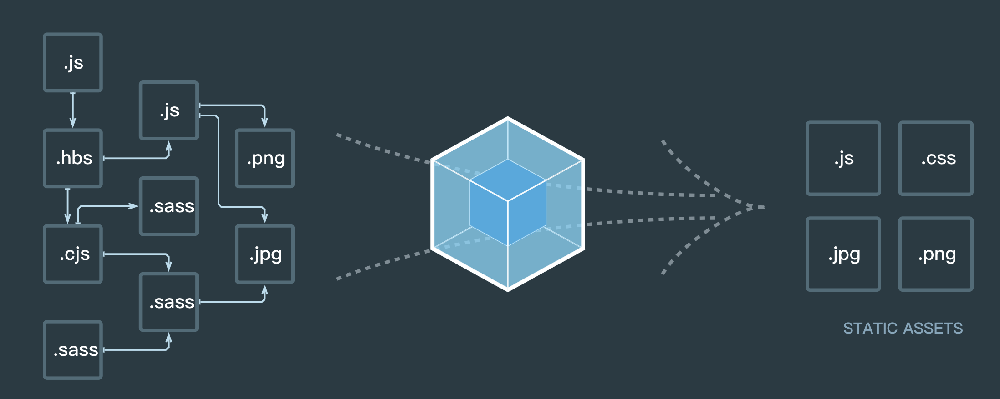
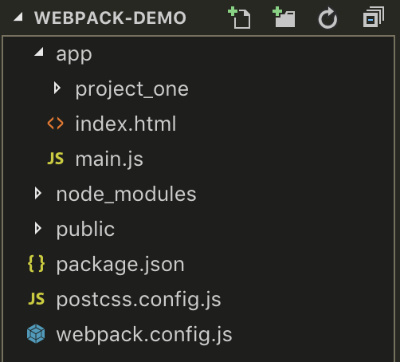
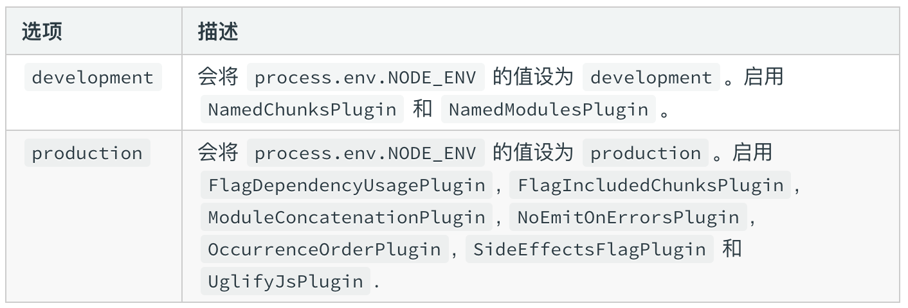

webpack是*静态模块打包器*，它有一个模块的概念，webpack将所有文件都看作是模块，将这些模块分类并配置一定的规则，按照这些规则进行处理的过程，就是webpack的工作过程。
webpack具体是如何工作的，在项目中该如何去使用，是这篇文章要跟大家分享的，我会将学到的内容及时分享在这里~
这篇文章，基于webpack 4.x版本，与webpack 3有一些不同之处，学习webpack3的也可以作为参考~
<!-- more -->

## 安装
1.在安装之前，我们需要在项目根目录已经创建好package.json文件，如果没有，执行以下指令去创建：
```npm init```
2.使用npm安装webpack，终端进入到项目根目录，执行以下指令进行安装：
```npm install webpack --save-dev```
3.创建目录，项目结构如下：

>app：我们所有的源文件都写在app文件夹下
>>main.js为webpack的入口文件（下面会讲到）
>>public为webpack打包后输出的文件夹
>>webpack.config.js为webpack配置文件（放在根目录下）

## 配置文件
为了更容易去理解，先简单介绍一些webpack的配置文件webpack.config.js

```
// 基本配置
var path = require('path');

module.exports = {
  mode: 'development',
  entry: './app/main.js',
  output: {
    path: path.resolve(__dirname, 'public'),
    filename: 'bundle.js'
  }
};
// 解释：这段代码告诉webpack，使用development模式的内置优化，以app文件夹下的main.js作为入口，以bundle.js作为输出，输出路径为根目录下的public文件夹。

```
##### mode：告知 webpack 使用相应模式的内置优化。
官方解释是这样的：

webpack 4之前是没有mode配置的。
##### entry：指定入口文件，也可以是个数组，放入多个入口文件
##### outpub：输出，可以控制webpack如何向硬盘写入编译文件

接下来，我们要做的事情：
1. 使用webpack来将项目中的.less文件转换为.css文件，并将生成的.css文件输出
2. 以app文件夹下的index.html为模板文件，输出新的.html文件，并引入.css文件

## 入口entry
目录中的main.js是webpack的入口文件，什么是入口文件？
入口文件，是为了让webpack知道我们项目使用了哪些模块，以及这些模块之间的依赖关系，即作为webpack内部依赖图的开始。

要将.less文件转换为.css文件，首先先创建.less文件：
在/app/project_one路径下创建 `common.less` 和 `index.less` 文件。
common.less 文件写入共用样式；
index.less 文件写入index.html页面用到的样式，该文件使用 `@import` 引入 `common.less`

common.less

```
html {
    box-sizing: border-box;
    -ms-text-size-adjust: 100%;
    -webkit-text-size-adjust: 100%;
}
*, *:before, *:after {
    box-sizing: inherit;
}
body {
    margin: 0;
    font-family: 'Helvetica Neue', Helvetica, Arial, sans-serif;
    background: red;
}
h1, h2, h3, h4, h5, h6, p, ul {
    margin: 0;
    padding: 0;
}
.flex{
    display: flex;
}
```

index.less

```
// index.less
@import 'common.less';
.main{
	width: calc(100% - 100px);
}
```

创建好我们的样式文件，接下来，需要在入口文件 `mian.js` 中引入样式文件，告诉webpack要处理的样式文件

main.js

```
import './project_one/index.less';
```

对比 Node.js 模块，webpack 模块能够以各种方式表达它们的依赖关系，几个例子如下：

* ES2015 import 语句
* CommonJS require() 语句
* AMD define 和 require 语句
* css/sass/less 文件中的 @import 语句。
* 样式(`url(...)`)或 HTML 文件(``)中的图片链接(image url)

## 输出output
在webpack中，配置output最低要求是，将它的值设置为一个对象，包括两个属性：
filename：输出的文件名称
path：输出的文件路径

在这里，我们这样配置：

```
output: {
    path: path.resolve(__dirname, 'public'),
    filename: 'bundle.js'
}
```

##### 补充：
如果，我们的入口文件有多个，配置文件中 entry 需要配置为数组；如果想让不同的入口文件，对应不同的输出文件，怎么办呢？可以使用占位符，需要了解的可以访问[占位符](https://www.webpackjs.com/configuration/output/#output-filename)

```
module.exports = {
    entry: {
    	  main: './app/main.js',
    	  index: './app/index.js'
    },
    output: {
        path: path.resolve(__dirname, 'public'),
        filename: '[name].bundle.js'
    }
}
```
##### 占位符
* name：entry 定义的 key 值，即上面代码中的 main 和 index
* hash：每次构建 webpack，都会生成唯一的 hash 值
* chunkhash：打包的模块会生成唯一 hash，模块有变动，重新打包的模块 hash 会生成新的；而没有更改的模块打包生成的 hash 不变

## 模块module
配置文件中的 模块 用于处理项目中不同类型的模块。
#### module.rules - module中的主要属性rules
创建模块时，匹配请求的规则数组
每个规则又有很多属性，这里我们主要用到了 `test` 和 `use`

* test：条件，即通过条件去匹配需要处理的文件
* use：在规则条件匹配时使用，每个use指定使用一个loader，loader 用于对模块的源代码进行转换， 下面会讲到

```
module: {
        rules: [
            {
                test: /\.less$/, // 正则匹配 .less 结尾的文件
                use: [
                   	 { loader: 'style-loader' } // 直接创建<style>加入到页面
                   	 // 'style-loader' 这里是简写，省略了loader
                ]
            }
        ]
    }
```

## 预处理器loader

需要的 loader 有：

* style-loader：会在html文件中插入<style></style>，并将打包好的css放入style中
* css-loader：加载 css 文件
* less-loader：将 .less 文件转换为 .css 文件

使用这些loader，首先要安装这些loader，nodejs中使用 npm 安装：

`npm install style-loader css-loader less-loader less --save-dev`

来看代码：

```
rules: [
	{
		test: /\.less$/,
		use: [
			// 这里都是简写
			'style-loader',
			'css-loader',
			'less-loader'
		]
	}
]
```

注意：值得注意的是，loader 是有加载顺序的，loader 的加载顺序是从后向前加载的，即：先加载less-loader 将 .less 文件转换为.css文件，其次加载 css-loader 处理.css文件，最后加载style-loader ，将css写入html。

## 插件plugins
插件，是用来扩展webpack功能的，它们会在整个构建过程中生效，执行相关的任务。
很多时候，Loaders 和 Plugins 很容易被搞混，其实它们是完全不同的东西，loaders 是在打包构建工程中用来处理源文件的，一次处理一个；插件不会直接操作单个文件，而直接对整个构建过程起作用。

这里，我们介绍 html-webpack-plugin 插件，它的作用有哪些呢？

1. 为 html 文件引入外部资源
2. 可以生成html入口文件，即.html文件；配置N个`html-webpack-plugin`可以生成N个页面

首先，通过`npm`安装`html-webpack-plugin`插件：
`npm install html-webpack-plugin --save-dev`

使用：

1. webpack 配置文件顶部require引入
2. plugins 中创建

```
const htmlWebpackPlugin = require('html-webpack-plugin');

// plugins 与 entry、output同级
plugins: [        
        new htmlWebpackPlugin({
            filename: 'index.html',
            template: './app/index.html',
            inject: 'body'
        })
]
```

解释一下：

* filename：生成的文件名称
* template：本地模板文件位置，生成的.html文件以指定的文件为模板
* inject: 引入的外部资源，插入到html中的位置

先附上完成配置文件代码：

```
const path = require('path');
const htmlWebpackPlugin = require('html-webpack-plugin');

module.exports = {
    entry: path.resolve(__dirname, 'app/main.js'),
    output: {
        path: path.resolve(__dirname, 'public'),
        filename: 'bundle.js'
    },
    module: {
        rules: [
            {
                test: /\.less$/,
                use: [
                    'style-loader', // 直接创建<style>加入到页面
                    'css-loader',
                    'less-loader'
                ]
            }
        ]
    },
    plugins: [
        new htmlWebpackPlugin({
            filename: 'index.html',
            template: './app/index.html',
            inject: 'body'
        })
    ],
    mode: 'development'
}
```

到这里，我们最初布置的任务就算完成了，接下来只剩下打包了~

## 打包
打包很简单，只需要在package.json中的scripts下添加如下代码：
`"start": "webpack --config webpack.config.js --progress --display-modules --colors --display-resasons"`
接着在终端，`cd`到项目根目录，运行`npm start`就开始运行webpack打包了~