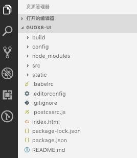
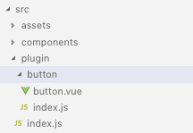
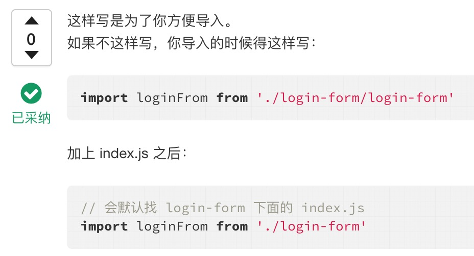
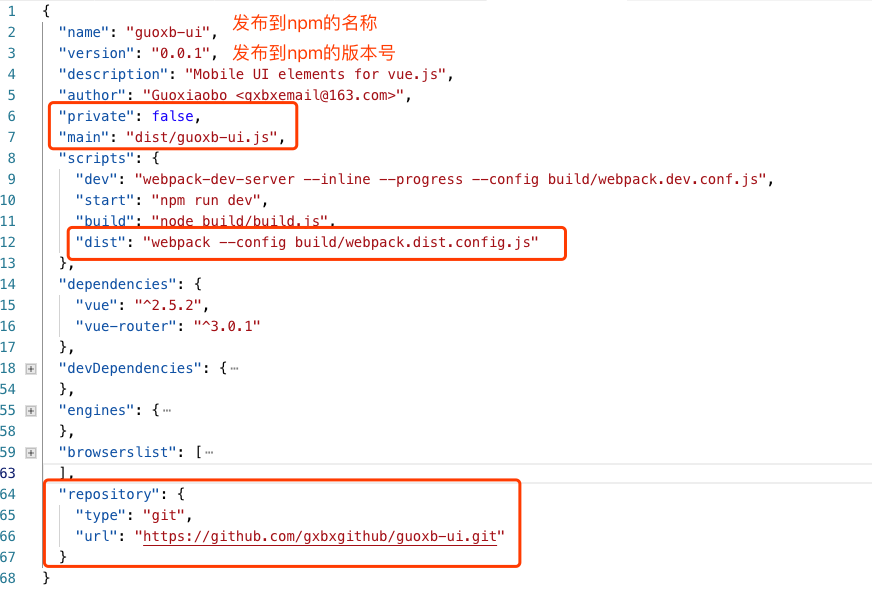

Vue.js 作为当下比较热门的技术，它的核心库只关注视图层，容易上手。组件是Vue.js最强大的功能之一。组件可以扩展HTML元素，封装可重用的代码。在较高层面上，组件是自定义的元素，Vue.js的编译器为它添加特殊功能。在有些情况下，组件也可以是原生HTML元素的形式，以js特性扩展。

这篇文章带你创建属于自己的组件库，并打包到 npm 供更多人使用。

<!-- more -->

### 一、 创建 Vue 项目

使用 vue-cli 脚手架创建项目 guoxb-ui

`vue init webpack guoxb-ui`

当然，也可以用 `vue init webpack-simple guoxb-ui` 创建简洁的项目

### 二、 项目架构目录



通过运行上述指令，生成的项目结构如图所示，大结构基本不用动，只需要添加自己的配置文件以及自己的文件夹即可。

添加的配置如下（从上至下依次拆分）：

##### 1. build 目录添加 webpack.dist.config.js

build 目录下存放着 webpack 的配置信息，在该目录下添加了一个单独打包插件的配置文件 webpack.dist.config.js

```
var path = require('path')
var webpack = require('webpack')

module.exports = {
**entry: './src/plugin/index.js', // 入口文件
  output: {
    path: path.resolve(__dirname, '../dist'), // 打包后的文件放这里
    publicPath: '/dist/',
    filename: 'guoxb-ui.js',
    library: 'guoxb-ui', // library指定的是引入项目的模块名
    libraryTarget: 'umd', // libraryTarget会生成不同umd的代码,可以只是commonjs标准的，也可以是指amd标准的，也可以只是通过script标签引入的（必须加上）
    umdNamedDefine: true // 会对 UMD 的构建过程中的 AMD 模块进行命名。否则就使用匿名的 define（必须加上）
  },**
  module: {
    rules: [
      {
        test: /\.css$/,
        use: [
          'vue-style-loader',
          'css-loader'
        ],
      },
      {
        test: /\.scss$/,
        use: [
          'vue-style-loader',
          'css-loader',
          'sass-loader'
        ],
      },
      {
        test: /\.sass$/,
        use: [
          'vue-style-loader',
          'css-loader',
          'sass-loader?indentedSyntax'
        ],
      },
      {
        test: /\.vue$/,
        loader: 'vue-loader',
        options: {
          loaders: {
            // Since sass-loader (weirdly) has SCSS as its default parse mode, we map
            // the "scss" and "sass" values for the lang attribute to the right configs here.
            // other preprocessors should work out of the box, no loader config like this necessary.
            'scss': [
              'vue-style-loader',
              'css-loader',
              'sass-loader'
            ],
            'sass': [
              'vue-style-loader',
              'css-loader',
              'sass-loader?indentedSyntax'
            ]
          }
          // other vue-loader options go here
        }
      },
      {
        test: /\.js$/,
        loader: 'babel-loader',
        exclude: /node_modules/
      },
      {
        test: /\.(png|jpg|gif|svg)$/,
        loader: 'file-loader',
        options: {
          name: '[name].[ext]?[hash]'
        }
      }
    ]
  },
  resolve: {
    alias: {
      'vue$': 'vue/dist/vue.esm.js'
    },
    extensions: ['*', '.js', '.vue', '.json']
  },
  devServer: {
    historyApiFallback: true,
    noInfo: true,
    overlay: true
  },
  performance: {
    hints: false
  },
  devtool: '#eval-source-map'
}

if (process.env.NODE_ENV === 'production') {
  module.exports.devtool = '#source-map'
  // http://vue-loader.vuejs.org/en/workflow/production.html
  module.exports.plugins = (module.exports.plugins || []).concat([
    new webpack.DefinePlugin({
      'process.env': {
        NODE_ENV: '"production"'
      }
    }),
    new webpack.optimize.UglifyJsPlugin({
      sourceMap: true,
      compress: {
        warnings: false
      }
    }),
    new webpack.LoaderOptionsPlugin({
      minimize: true
    })
  ])
}
```

这段配置代码实际是 `npm init webpack-simple guoxb-ui` 生成项目中的 webpack.config.js 文件中的代码，我们只需要改的就是 入口文件 和 输出文件

##### 2. src下创建plugin文件夹，所有自定义组件都放这里



其中，button 文件夹存放 自定义的button组件 button.vue 以及 用于导出组件的 index.js；

plugin 目录下的 index.js 用于添加我们的组件内容，以及注册组件。

###### plugin -> button -> button.vue 源码

```
<template>
  <div>
    <button
      class="guoxb-button"
      :class="['guoxb-button--' + type, 'guoxb-button--' + (round ? 'round' : '')]"
    >
      <slot></slot>
    </button>
  </div>
</template>

<script>
export default {
  name: "g-button", // *** 我们是全局注入组件，所以在后面引入我们的组件后，会使用这个命名的标签 ***
  props: {
    type: {
      type: String,
      default: "normal"
    },
    round: {
      type: Boolean,
      default: false
    }
  }
};
</script>

<style scoped>
.guoxb-button {
  font-size: 14px;
  color: #f68;
  background: #fff;
  border: 1px solid #eee;
}
.guoxb-button--normal {
  width: 100px;
  line-height: 40px;
}
.guoxb-button--small {
  width: 80px;
  line-height: 30px;
  font-size: 12px;
}
.guoxb-button--large {
  width: 120px;
  line-height: 50px;
  font-size: 16px;
}
.guoxb-button--round {
  border-radius: 5px;
}
</style>
```

###### plugin -> button -> index.js 源码

```
export { default } from './button.vue';
```

###### plugin -> index.js 源码

```
import GButton from './button';
import *** from './***';

const install = function(Vue, options) {
    if (install.installed) return;
    Vue.component(GButton.name, GButton);
    Vue.component(***.name, ***);
}

/* 支持使用标签的方式引入 */
if (typeof window !== 'undefined' && window.Vue) {
    install(window.Vue);
}

export default {
    install,
    GButton,
    ***
}
```

###### 疑问：为什么在button文件夹下还要创建index.js



这是从网上找到的答案，可能并没有太大说服力，所以又仔细的查看了[vue官方文档](https://cn.vuejs.org/v2/guide/plugins.html)

> 插件通常用来为 Vue 添加全局功能。插件的功能范围没有严格的限制——一般有下面几种：
> (1) 添加全局方法或者属性。如: vue-custom-element
> (2) 添加全局资源：指令/过滤器/过渡等。如 vue-touch
> (3) 通过全局混入来添加一些组件选项。如 vue-router
> (4) 添加 Vue 实例方法，通过把它们添加到 Vue.prototype 上实现。
> (5) 一个库，提供自己的 API，同时提供上面提到的一个或多个功能。如 vue-router

不难理解，当我们的组件需要为Vue添加全局功能的时候，是需要在index.js导出组件之前，来完成这步操作的！

所以，官方文档也给出了为Vue添加全局功能的方法：

```
MyPlugin.install = function (Vue, options) {
  // 1. 添加全局方法或属性
  Vue.myGlobalMethod = function () {
    // 逻辑...
  }

  // 2. 添加全局资源
  Vue.directive('my-directive', {
    bind (el, binding, vnode, oldVnode) {
      // 逻辑...
    }
    ...
  })

  // 3. 注入组件选项
  Vue.mixin({
    created: function () {
      // 逻辑...
    }
    ...
  })

  // 4. 添加实例方法
  Vue.prototype.$myMethod = function (methodOptions) {
    // 逻辑...
  }
}
```

这段代码是要写在组件内部的 index.js 里面的。

### 三、 测试组件

在任一页面引入组件，作测试，例如：

在src - components - HelloWorld.vue 下引入组件

```
<template>
  <div class="hello">
   <g-button :round="true" type="normal">按钮</g-button>
  </div>
</template>

<script>

import Vue from 'vue';
/* 打包前的组件测试 */
import GuoUI from '@/plugin/index.js';
/* 打包后的组件测试(打包后，会在项目根目录生成dist文件夹) */
// import GuoUI from '../../dist/guoxb-ui.js';
Vue.use(GuoUI);

export default {
  name: 'HelloWorld',
  data () {
    return {

    }
  }
}
</script>
```

运行项目，测试组件

### 四、 打包

这里需要修改 package.json 文件，如图所示：



* main属性：打包到dist下的文件，也是以后安装引用使用的js文件
* scripts 中添加 `"dist": "webpack --config build/webpack.dist.config.js"` 用于打包
* repository 仓库，可以不写，如果不写，npm官网就没有跳到你github上的入口

做完以上配置，控制台输入 `npm run dist` 开始打包，打包成功后，会在项目根目录生成 dist 文件夹，里面是package.json -> main属性配置的 guoxb-ui.js 文件

可以再引入 dist 下的 guoxb-ui.js 文件测试组件

### 五、 发布组件

测试ok了，接下来就是发布组件到 npm，首先得有npm账号，如果没有请走注册。

控制台，项目根目录下，执行命令：`npm login` 登录 npm，此时会让输入用户名、密码以及邮箱；

登录成功之后，执行命令：`npm publish` 即可。

记住，每次发布，需要修改 package.json 版本号，不然报错。

发布完之后，就可以转到我们的 npm官网 上查看我们的项目。

[https://www.npmjs.com/package/guoxb-ui](https://www.npmjs.com/package/guoxb-ui)

