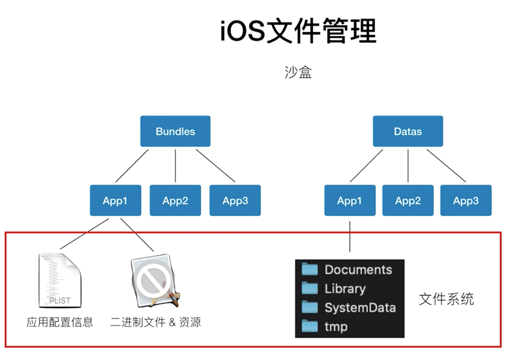
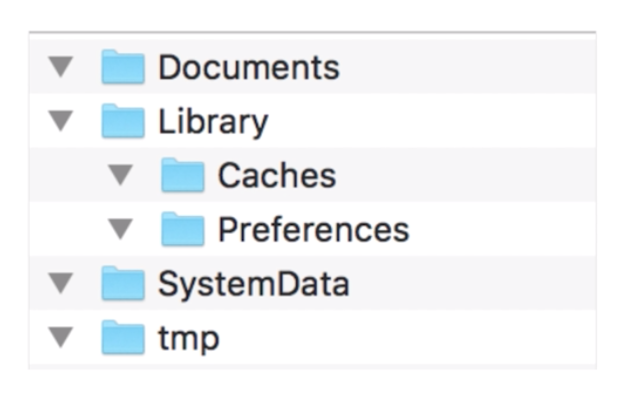

iOS 当中，每个 App程序 都有一个独立的文件管理系统，而且只能操作对应的文件系统当中的数据，这个文件系统被称为 **沙盒**。

<!-- more -->

### 1. 沙盒



沙盒分为两部分，一部分存放在独立的文件夹 Bundles 中，用于存放应用的二进制文件和应用的资源文件，以及 plist 应用配置信息等；还有一部分是苹果为我们分配好的Datas文件夹下的一些子文件目录，我们应用当中产生的数据，缓存信息等可以存放在这些目录下。



* `Documents/` 可以进行备份和恢复，体积较大，一般存档用户数据（总结为：用户生产以及共享的文件）
* `Library/` 开发者最常用的文件夹，可以自定义子文件夹，可用来放置希望被备份但不希望被用户看到的数据。该路径下的文件夹，除Caches以外，都会被iTunes备份
	* `Caches` 保存应用程序支持文件和缓存文件
	* `Preferences` 保存应用程序偏好设置文件。`NSUserDefaults` 类创建的数据和 `plist` 文件都放在这里
* `SystemData/` 顾名思义，就是系统提供的一些数据
* `tmp/` 临时数据，不会备份，启动是有可能被清空

``` Objective-C
// 获取沙盒根目录路径
NSString *homeDir = NSHomeDirectory();

// 获取Documents目录路径
NSString *docDir = [NSSearchPathForDirectoriesInDomains(NSDocumentDirectory, NSUserDomainMask, YES) firstObject];

// 获取Library的目录路径
NSString *libDir = [NSSearchPathForDirectoriesInDomains(NSLibraryDirectory, NSUserDomainMask, YES) firstObject];

// 获取应用程序程序包中资源文件路径
NSString *bundle = [[NSBundle mainBundle] bundlePath];
```

### 2. NSFileManager

* 单例，提供 APP内 文件&文件夹 管理功能
* 创建文件、删除文件、查询文件、移动和复制等
* 读取文件内容 & 属性

``` Objective-C
NSString *cacheDir = [NSSearchPathForDirectoriesInDomains(NSCachesDirectory, 	NSUserDomainMask, YES) firstObject];
    
NSFileManager *fileManager = [NSFileManager defaultManager];
    
// 创建GTData文件夹
NSString *dirPath = [cacheDir stringByAppendingPathComponent:@"GTData"];
    
NSError *error;
[fileManager createDirectoryAtPath:dirPath withIntermediateDirectories:YES attributes:nil error:&error];
    
// 创建list文件
NSString *filePath = [dirPath stringByAppendingPathComponent:@"list"];
    
NSData *fileData = [@"我是数据" dataUsingEncoding:NSUTF8StringEncoding];
    
[fileManager createFileAtPath:filePath contents:fileData attributes:nil];
    
// 查询文件
BOOL fileExist = [fileManager fileExistsAtPath:filePath];
    
// 删除文件
if (fileExist) {
    [fileManager removeItemAtPath:filePath error:nil];
}
```

### 3. NSFileHandle

* 读取文件 & 写文件
* 读取指定长度 & 在指定位置追加/截取
* 截断 & 立即刷新
* 常用于追加数据

```
// 像以上创建的文件追加内容
NSFileHandle *fileHandle = [NSFileHandle fileHandleForUpdatingAtPath:filePath];
[fileHandle seekToEndOfFile];
[fileHandle writeData:[@" 我是追加的内容" dataUsingEncoding:NSUTF8StringEncoding]];

// 更新文件并关闭handle
[fileHandle synchronizeFile];
[fileHandle closeFile];
```